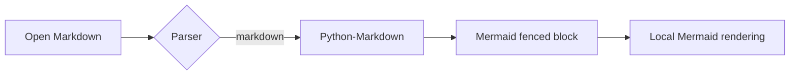
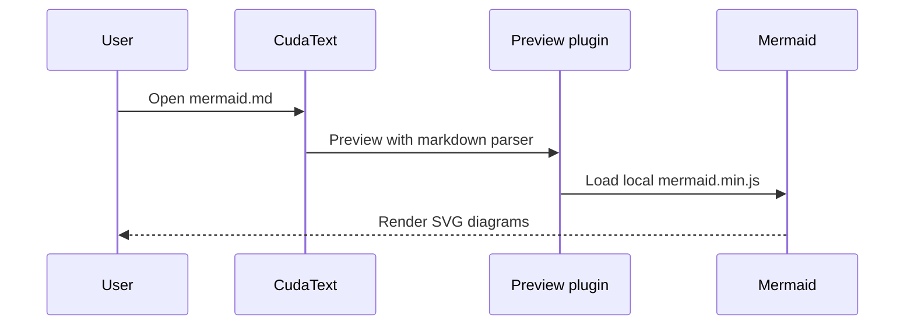

# Mermaid local rendering test

This document uses the local Python-Markdown parser and the bundled Mermaid
11.16.1 assets. Select the `markdown` parser when previewing it.

## Flowchart

## Sequence diagram

